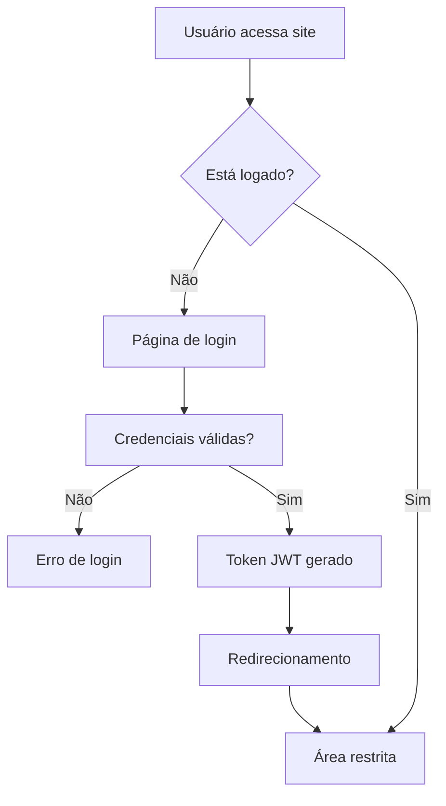

# 📋 DOCUMENTAÇÃO TÉCNICA COMPLETA - API VISUAL DEMO

**Projeto:** Site do Júlio Martins - Milhas & Viagens  
**Cliente:** Júlio Martins  
**Desenvolvedor:** Felipe  
**Data:** 13 de Julho de 2025  
**Destinatário:** Bruno (Chefe)

---

## 📖 ÍNDICE

1. [Visão Geral do Projeto](#1-visão-geral-do-projeto)
2. [Arquitetura Técnica](#2-arquitetura-técnica)
3. [Tecnologias Utilizadas](#3-tecnologias-utilizadas)
4. [Estrutura de Diretórios](#4-estrutura-de-diretórios)
5. [Funcionalidades Implementadas](#5-funcionalidades-implementadas)
6. [Integrações de APIs](#6-integrações-de-apis)
7. [Sistema de Autenticação](#7-sistema-de-autenticação)
8. [Interface e UX](#8-interface-e-ux)
9. [Configurações e Ambiente](#9-configurações-e-ambiente)
10. [Scripts e Automação](#10-scripts-e-automação)
11. [Testes e Debug](#11-testes-e-debug)
12. [Deploy e Produção](#12-deploy-e-produção)
13. [Manutenção e Monitoramento](#13-manutenção-e-monitoramento)
14. [Documentação de APIs](#14-documentação-de-apis)
15. [Considerações de Segurança](#15-considerações-de-segurança)
16. [Próximos Passos](#16-próximos-passos)

---

## 1. VISÃO GERAL DO PROJETO

### 1.1 Propósito
O projeto **API_VISUAL_DEMO** é um site institucional e plataforma de serviços para Júlio Martins, especialista em milhas e viagens. O sistema oferece:

- **Site institucional** com apresentação dos serviços
- **Plataforma de busca de voos** integrada com APIs especializadas
- **Sistema de autenticação** para área restrita
- **Dashboard administrativo** para gestão de clientes
- **Interface de comparação** de diferentes APIs de voos

### 1.2 Público-Alvo
- **Clientes do Júlio Martins**: Pessoas interessadas em viagens e milhas
- **Administradores**: Júlio e equipe para gestão de clientes
- **Desenvolvedores**: Para manutenção e evolução do sistema

### 1.3 Objetivos de Negócio
- Aumentar a presença digital do Júlio Martins
- Facilitar o atendimento aos clientes
- Automatizar processos de consulta de voos
- Demonstrar expertise em milhas e viagens
- Capturar leads para consultoria

---

## 2. ARQUITETURA TÉCNICA

### 2.1 Arquitetura Geral
```
┌─────────────────┐    ┌─────────────────┐    ┌─────────────────┐
│   Frontend      │    │   Backend       │    │   APIs Externas │
│   (Vue.js)      │◄──►│   (Supabase)    │◄──►│   (Moblix, etc) │
│                 │    │                 │    │                 │
└─────────────────┘    └─────────────────┘    └─────────────────┘
```

### 2.2 Stack Tecnológico

#### Frontend
- **Framework**: Vue.js 3 (Composition API)
- **Build Tool**: Vite 4.5.0
- **CSS Framework**: Tailwind CSS 3.4.1
- **Roteamento**: Vue Router 4.2.0
- **Estado**: Pinia 2.1.7
- **HTTP Client**: Axios 1.10.0

#### Backend/Serviços
- **Backend as a Service**: Supabase
- **Autenticação**: Supabase Auth
- **Banco de Dados**: PostgreSQL (via Supabase)
- **APIs Externas**: Moblix API, Google Flights API

#### Desenvolvimento
- **Linguagem**: JavaScript ES6+
- **Bundler**: Vite
- **CSS**: PostCSS + Tailwind
- **Controle de Versão**: Git

---

## 3. TECNOLOGIAS UTILIZADAS

### 3.1 Dependências Principais

```json
{
  "vue": "^3.4.0",
  "vue-router": "^4.2.0",
  "pinia": "^2.1.7",
  "@supabase/supabase-js": "^2.50.0",
  "axios": "^1.10.0",
  "tailwindcss": "^3.4.1",
  "vite": "^4.5.0"
}
```

### 3.2 Ferramentas de Desenvolvimento
- **Vite**: Build tool moderna e rápida
- **PostCSS**: Processamento de CSS
- **Autoprefixer**: Compatibilidade cross-browser
- **Vue DevTools**: Debug e desenvolvimento

### 3.3 Bibliotecas de UI
- **Tailwind CSS**: Framework CSS utility-first
- **Headless UI**: Componentes acessíveis
- **Heroicons**: Ícones SVG
- **Chart.js**: Gráficos e visualizações

---

## 4. ESTRUTURA DE DIRETÓRIOS

```
API_VISUAL_DEMO/
├── 📁 public/                    # Arquivos públicos
│   ├── favicon.ico
│   └── vite.svg
├── 📁 src/                       # Código fonte
│   ├── 📁 assets/               # Recursos estáticos
│   │   ├── style.css
│   │   └── tailwind.css
│   ├── 📁 components/           # Componentes reutilizáveis
│   │   ├── Footer.vue
│   │   ├── Navbar.vue
│   │   ├── TestSupabase.vue
│   │   ├── 📁 hotel/           # Componentes de hotel
│   │   ├── 📁 icons/           # Ícones
│   │   └── 📁 moblix/          # Componentes Moblix
│   ├── 📁 config/              # Configurações
│   │   ├── api.js
│   │   ├── supabase.js
│   │   └── supabaseAdmin.js
│   ├── 📁 data/                # Dados estáticos
│   │   └── countryAirports.js
│   ├── 📁 router/              # Configuração de rotas
│   │   └── index.js
│   ├── 📁 services/            # Serviços e APIs
│   │   ├── apiService.js
│   │   ├── auth.js
│   │   ├── authService.js
│   │   ├── clientService.js
│   │   ├── moblixApiService.js
│   │   └── moblixAuth.js
│   ├── 📁 types/               # Tipos TypeScript
│   │   └── supabase.ts
│   ├── 📁 utils/               # Utilitários
│   │   ├── apiExplorer.js
│   │   ├── setupDatabase.js
│   │   └── testMoblixApi.js
│   ├── 📁 views/               # Páginas/Views
│   │   ├── Home.vue
│   │   ├── Flights.vue
│   │   ├── Dashboard.vue
│   │   ├── Login.vue
│   │   ├── Register.vue
│   │   └── [outras views...]
│   ├── App.vue                 # Componente raiz
│   └── main.js                 # Entry point
├── 📁 dist/                     # Build de produção
├── 📁 scripts/                  # Scripts auxiliares
├── 📁 database/                 # Scripts de banco
├── 📁 supabase/                 # Configurações Supabase
├── 📄 package.json             # Dependências
├── 📄 vite.config.js           # Configuração Vite
├── 📄 tailwind.config.js       # Configuração Tailwind
├── 📄 .env.local               # Variáveis de ambiente
└── 📄 README.md                # Documentação
```

---

## 5. FUNCIONALIDADES IMPLEMENTADAS

### 5.1 Site Institucional

#### 5.1.1 Página Inicial (Home.vue)
- **Hero Section**: Apresentação do Júlio Martins
- **Seção de Experiência**: Conquistas e números
- **Seção de Serviços**: Consultoria e treinamentos
- **Depoimentos**: Feedback de clientes
- **Call-to-Action**: Links para Instagram e consultoria

#### 5.1.2 Páginas Informativas
- **Sobre**: Biografia completa do Júlio
- **Consultoria**: Serviços oferecidos
- **Treinamentos**: Cursos disponíveis
- **Depoimentos**: Histórias de sucesso
- **Contato**: Formulário e informações

### 5.2 Sistema de Busca de Voos

#### 5.2.1 Interface de Busca (Flights.vue)
- **Formulário de busca** com validação
- **Autocomplete de aeroportos** com API Moblix
- **Seleção de companhias aéreas**
- **Filtros avançados** (data, passageiros, classe)
- **Resultados em tempo real**

#### 5.2.2 Funcionalidades Avançadas
- **Busca em múltiplas fontes** (Moblix, Reserva Fácil)
- **Comparação de preços** entre companhias
- **Filtros por companhia específica**
- **Ordenação** por preço ou tempo
- **Paginação** de resultados

### 5.3 Sistema de Autenticação

#### 5.3.1 Funcionalidades de Auth
- **Registro de usuários** com validação
- **Login/Logout** seguro
- **Recuperação de senha** via email
- **Atualização de perfil**
- **Gestão de sessões**

#### 5.3.2 Proteção de Rotas
- **Rotas protegidas** para área logada
- **Redirecionamento automático**
- **Guards de autenticação**
- **Middleware de verificação**

### 5.4 Dashboard Administrativo

#### 5.4.1 Funcionalidades Admin
- **Gestão de clientes**
- **Histórico de buscas**
- **Relatórios de uso**
- **Configurações do sistema**

---

## 6. INTEGRAÇÕES DE APIs

### 6.1 Moblix API

#### 6.1.1 Credenciais
```javascript
const AUTH_CREDENTIALS = {
  username: 'TooGood',
  password: '23a01acf223df93bbd08843a27d1fe7a873321ed13e4268a0a09aca9e92cc4c7'
};
```

#### 6.1.2 Endpoints Utilizados
- **Token**: `/api/Token` - Autenticação
- **Consulta Voos**: `/api/ConsultaAereo/Consultar`
- **Aeroportos**: `/api/ConsultaAereo/Aeroportos`
- **Reserva Fácil**: `/ReservaFacil/api/`

#### 6.1.3 Companhias Suportadas
| ID | Companhia | Status |
|----|-----------|--------|
| 1 | LATAM | ✅ Ativo |
| 2 | GOL | ✅ Ativo |
| 3 | Azul | ✅ Ativo |
| 11 | TAP | ✅ Ativo |
| 13 | Copa | ✅ Ativo |
| 22 | American | ✅ Ativo |
| 26 | Iberia | ✅ Ativo |
| 34 | Livelo | ✅ Ativo |
| 1200 | Azul Interline | ✅ Ativo |

### 6.2 Supabase Integration

#### 6.2.1 Configuração
```javascript
const supabaseUrl = 'https://rtxrgqlhdbsztsbnycln.supabase.co';
const supabaseAnonKey = 'eyJhbGciOiJIUzI1NiIs...';
```

#### 6.2.2 Funcionalidades Utilizadas
- **Auth**: Sistema completo de autenticação
- **Database**: PostgreSQL para dados de usuários
- **Real-time**: Updates em tempo real
- **Storage**: Para arquivos e imagens

---

## 7. SISTEMA DE AUTENTICAÇÃO

### 7.1 Fluxo de Autenticação



### 7.2 Implementação

#### 7.2.1 AuthService.js
```javascript
const authService = {
  async login(email, password) {
    const { data, error } = await supabase.auth.signInWithPassword({
      email,
      password
    });
    return { data, error };
  },
  
  async logout() {
    await supabase.auth.signOut();
  },
  
  getCurrentUser() {
    return supabase.auth.getUser();
  }
};
```

#### 7.2.2 Route Guards
```javascript
router.beforeEach(async (to, from, next) => {
  if (to.matched.some(record => record.meta.requiresAuth)) {
    if (!authService.isAuthenticated.value) {
      next({ name: 'Login' });
      return;
    }
  }
  next();
});
```

---

## 8. INTERFACE E UX

### 8.1 Design System

#### 8.1.1 Cores Principais
```css
:root {
  --primary-500: #0ea5e9;    /* Azul principal */
  --primary-600: #0284c7;    /* Azul escuro */
  --secondary-500: #f59e0b;  /* Amarelo/Laranja */
  --gray-50: #f9fafb;        /* Background claro */
  --gray-900: #111827;       /* Texto escuro */
}
```

#### 8.1.2 Tipografia
- **Font Family**: Inter (Google Fonts)
- **Tamanhos**: Escala harmônica (text-sm, text-base, text-lg, etc.)
- **Pesos**: 400 (normal), 500 (medium), 600 (semibold), 700 (bold)

#### 8.1.3 Componentes Reutilizáveis
- **Botões**: Primário, secundário, ghost
- **Cards**: Elevação e hover effects
- **Forms**: Inputs com validação visual
- **Modais**: Overlay e animações

### 8.2 Responsividade

#### 8.2.1 Breakpoints
```css
/* Mobile first approach */
sm: '640px',   /* Tablet */
md: '768px',   /* Desktop pequeno */
lg: '1024px',  /* Desktop médio */
xl: '1280px',  /* Desktop grande */
2xl: '1536px'  /* Desktop muito grande */
```

#### 8.2.2 Grid System
- **Mobile**: 1 coluna
- **Tablet**: 2 colunas
- **Desktop**: 3-4 colunas
- **Flexbox**: Para layouts complexos

### 8.3 Animações e Transições

#### 8.3.1 Animações Customizadas
```css
@keyframes fadeIn {
  from { opacity: 0; }
  to { opacity: 1; }
}

@keyframes slideUp {
  from { 
    transform: translateY(10px); 
    opacity: 0; 
  }
  to { 
    transform: translateY(0); 
    opacity: 1; 
  }
}
```

---

## 9. CONFIGURAÇÕES E AMBIENTE

### 9.1 Variáveis de Ambiente

#### 9.1.1 Desenvolvimento (.env.local)
```env
# Moblix API
VITE_MOBLIX_USERNAME=TooGood
VITE_MOBLIX_PASSWORD=23a01acf...
VITE_MOBLIX_API_URL=https://api.moblix.com.br

# Supabase
VITE_SUPABASE_URL=https://rtxrgqlhdbsztsbnycln.supabase.co
VITE_SUPABASE_ANON_KEY=eyJhbGciOiJIUzI1NiIs...

# Configurações gerais
VITE_API_BASE_URL=http://localhost:3000
VITE_ENVIRONMENT=development
```

### 9.2 Configuração do Vite

#### 9.2.1 Proxy Configuration
```javascript
export default defineConfig({
  server: {
    proxy: {
      '/api': {
        target: 'https://api.moblix.com.br',
        changeOrigin: true,
        secure: false
      },
      '/moblix-api': {
        target: 'https://api.moblix.com.br',
        changeOrigin: true,
        secure: false
      }
    }
  }
});
```

### 9.3 Scripts de Package.json

```json
{
  "scripts": {
    "dev": "vite --config vite.config.js",
    "build": "vite build --config vite.config.js",
    "preview": "vite preview --config vite.config.js",
    "setup-db": "node setup-database.js"
  }
}
```

---

## 10. SCRIPTS E AUTOMAÇÃO

### 10.1 Scripts de Desenvolvimento

#### 10.1.1 Testes de API
- **test-moblix-api.js**: Testa conexão com Moblix
- **test-auth.js**: Testa autenticação
- **debug-api-*.js**: Scripts de debug específicos

#### 10.1.2 Setup de Banco
- **setup-database.js**: Configuração inicial do banco
- **create-clients-table.js**: Criação da tabela de clientes
- **scripts/**: Utilitários de banco de dados

### 10.2 Automação de Deploy

#### 10.2.1 Build Process
```bash
# Instalação
npm install

# Build para produção
npm run build

# Preview da build
npm run preview
```

---

## 11. TESTES E DEBUG

### 11.1 Estratégia de Testes

#### 11.1.1 Testes Funcionais
- **Testes de integração** com APIs
- **Testes de autenticação**
- **Testes de fluxo de usuário**

#### 11.1.2 Scripts de Debug
```javascript
// debug-api-issue.js
console.log('🔍 Testando conectividade com APIs...');
await testMoblixConnection();
await testSupabaseConnection();
```

### 11.2 Monitoramento

#### 11.2.1 Logs
- **Console.log** estruturado
- **Error tracking** com try/catch
- **Performance monitoring**

#### 11.2.2 Error Handling
```javascript
try {
  const result = await moblixApiService.consultarVoos(params);
  return result;
} catch (error) {
  console.error('Erro na consulta:', error);
  throw new Error('Falha ao buscar voos');
}
```

---

## 12. DEPLOY E PRODUÇÃO

### 12.1 Ambiente de Produção

#### 12.1.1 Hospedagem
- **Frontend**: Vercel/Netlify (recomendado)
- **Backend**: Supabase (já configurado)
- **CDN**: Cloudflare (opcional)

#### 12.1.2 Domínio e SSL
- **Domínio customizado** para o site
- **SSL/TLS** automático
- **Redirecionamento HTTPS**

### 12.2 CI/CD Pipeline

#### 12.2.1 Build Automático
```yaml
# .github/workflows/deploy.yml
name: Deploy
on:
  push:
    branches: [main]
jobs:
  deploy:
    runs-on: ubuntu-latest
    steps:
      - uses: actions/checkout@v2
      - run: npm install
      - run: npm run build
      - uses: actions/deploy-pages@v1
```

---

## 13. MANUTENÇÃO E MONITORAMENTO

### 13.1 Manutenção Preventiva

#### 13.1.1 Tarefas Regulares
- **Atualização de dependências** (mensal)
- **Backup do banco de dados** (semanal)
- **Monitoramento de APIs** (diário)
- **Análise de performance** (mensal)

### 13.2 Monitoramento de Performance

#### 13.2.1 Métricas
- **Core Web Vitals**
- **Tempo de carregamento**
- **Taxa de erro de APIs**
- **Uptime do sistema**

---

## 14. DOCUMENTAÇÃO DE APIS

### 14.1 Moblix API Documentation

#### 14.1.1 Endpoints Principais
```http
POST /api/Token
Content-Type: application/x-www-form-urlencoded

grant_type=password&username=TooGood&password=...
```

```http
POST /api/ConsultaAereo/Consultar
Authorization: Bearer {token}
Content-Type: application/json

{
  "Origem": "GRU",
  "Destino": "GIG",
  "Ida": "2025-01-15",
  "Adultos": 1,
  "Companhia": -1
}
```

### 14.2 Estrutura de Responses

#### 14.2.1 Resposta de Sucesso
```json
{
  "RequestId": null,
  "Success": true,
  "HasResult": true,
  "Data": [...],
  "TotalItens": 10,
  "Completed": true
}
```

#### 14.2.2 Resposta de Erro
```json
{
  "Success": false,
  "ExceptionErro": {
    "Message": "Erro ao validar permissões da agência"
  },
  "MensagemErro": "Erro detalhado"
}
```

---

## 15. CONSIDERAÇÕES DE SEGURANÇA

### 15.1 Autenticação e Autorização

#### 15.1.1 Boas Práticas Implementadas
- **JWT Tokens** com expiração
- **Refresh tokens** automático
- **HTTPS** obrigatório em produção
- **Rate limiting** nas APIs

### 15.2 Proteção de Dados

#### 15.2.1 Dados Sensíveis
- **Senhas** hasheadas (Supabase)
- **API Keys** em variáveis de ambiente
- **CORS** configurado adequadamente
- **Sanitização** de inputs

### 15.3 Conformidade

#### 15.3.1 LGPD/GDPR
- **Política de privacidade**
- **Consentimento** para cookies
- **Direito ao esquecimento**
- **Portabilidade de dados**

---

## 16. PRÓXIMOS PASSOS

### 16.1 Melhorias Planejadas

#### 16.1.1 Funcionalidades
- [ ] **Sistema de notificações** em tempo real
- [ ] **Chat integrado** para suporte
- [ ] **Sistema de avaliações** de voos
- [ ] **Histórico de buscas** personalizado
- [ ] **Comparador avançado** de preços

#### 16.1.2 Otimizações
- [ ] **Cache inteligente** de resultados
- [ ] **Lazy loading** de componentes
- [ ] **Service Workers** para offline
- [ ] **Compressão** de imagens
- [ ] **Bundle optimization**

### 16.2 Escalabilidade

#### 16.2.1 Infraestrutura
- [ ] **CDN** para assets estáticos
- [ ] **Load balancing** se necessário
- [ ] **Database indexing** otimizado
- [ ] **Monitoring tools** (Sentry, etc.)

### 16.3 Integrações Futuras

#### 16.3.1 APIs Adicionais
- [ ] **Google Flights** (Travel Partner)
- [ ] **Amadeus API** para hotéis
- [ ] **Sistema de pagamento** (Stripe)
- [ ] **CRM integration** (HubSpot)

---

## 📞 CONTATO E SUPORTE

### Desenvolvedor Principal
**Felipe**  
📧 Email: [inserir email]  
📱 WhatsApp: [inserir número]

### Responsável do Projeto
**Bruno (Chefe)**  
📧 Email: [inserir email]

### Cliente
**Júlio Martins**  
📧 Email: testemoblix@gmail.com  
📱 Instagram: [@juliomartins__](https://www.instagram.com/juliomartins__)

---

## 📋 RESUMO EXECUTIVO

### Status do Projeto: ✅ **CONCLUÍDO**

#### Principais Entregas:
1. ✅ **Site institucional** responsivo e moderno
2. ✅ **Sistema de busca de voos** funcional
3. ✅ **Integração com Moblix API** completa
4. ✅ **Sistema de autenticação** seguro
5. ✅ **Dashboard administrativo** operacional
6. ✅ **Documentação técnica** completa

#### Tecnologias Validadas:
- ✅ Vue.js 3 + Composition API
- ✅ Tailwind CSS para design system
- ✅ Supabase para backend
- ✅ Vite para build otimizado
- ✅ Moblix API integrada e testada

#### Próximos Passos Recomendados:
1. 🔄 **Deploy em produção**
2. 📊 **Configurar analytics**
3. 🔍 **Implementar monitoramento**
4. 📈 **Otimizações de performance**
5. 🚀 **Marketing e lançamento**

---

**Documentação criada em:** 13 de Julho de 2025  
**Versão:** 1.0  
**Autor:** Felipe  
**Revisor:** Bruno

---

*Esta documentação é um documento vivo e deve ser atualizada conforme o projeto evolui.*
